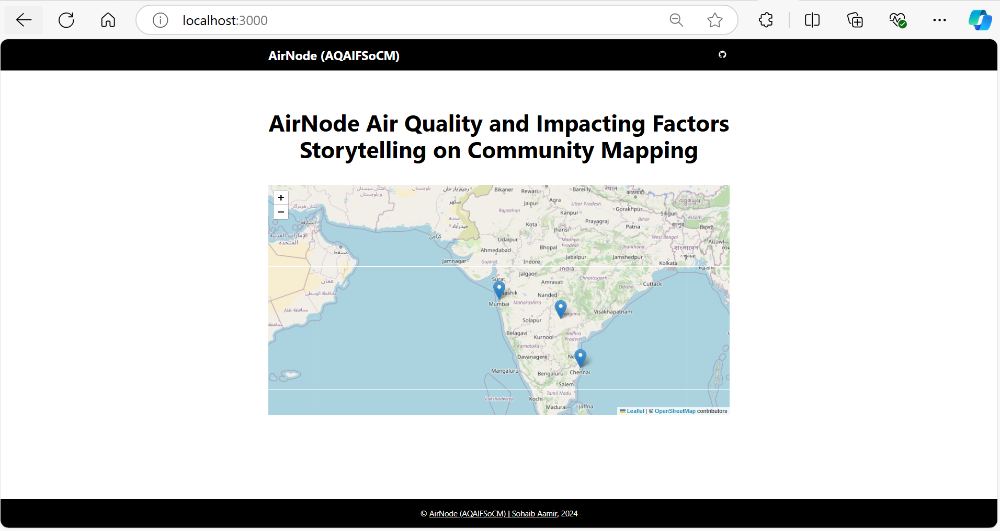

# AirNode Air Quality Project

 <!-- Update the logo path if available -->

This project utilizes Next.js to create an interactive air quality mapping application that displays live air quality data for multiple cities during the Diwali festivities.

## Table of Contents
- [Features](#features)
- [Technologies Used](#technologies-used)
- [Getting Started](#getting-started)
- [Project Structure](#project-structure)
- [Components](#components)
- [API Integration](#api-integration)
- [Contributing](#contributing)
- [License](#license)

## Features
- Interactive map showing the air quality of major cities in India: **Mumbai**, **Hyderabad**, and **Chennai**.
- Dynamic display of air quality statistics for each city using real-time data from OpenAQ API.
- Responsive design to ensure a seamless experience across various devices.
- Display of city descriptions and air quality levels when markers on the map are clicked.
- Easy navigation and user-friendly interface.

## Technologies Used
- **Next.js**: A React framework for building server-rendered and statically generated web applications.
- **React**: A JavaScript library for building user interfaces.
- **Leaflet**: A JavaScript library for interactive maps.
- **Axios**: A promise-based HTTP client for making API requests.
- **CSS Modules**: For scoped and modular styles.
- **OpenAQ API**: For fetching real-time air quality data.

## Getting Started

### Prerequisites
- Node.js (>= 14.x)
- npm (>= 5.x)

### Installation
1. Clone the repository:
   ```bash
   git clone https://github.com/SohaibAamir28/AirNode-Air-Quality-NASA-Project.git
   cd AirNode-Air-Quality-NASA-Project

